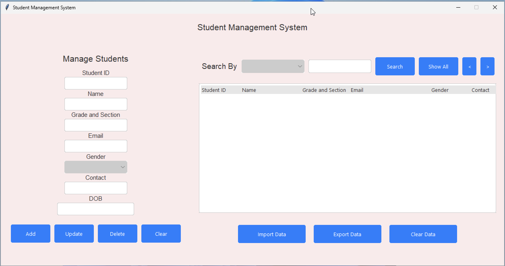

Implementing MongoDB using "pymongo"
------------------------------------------------------------------------------------------------------------------------------------

 

  <bold> Tkinter GUI </bold>
  

  

 ------------------------------------------------------------------------------------------------------------------------------------  
Inorder to change between these themes ... Open `student_system.py` and search for this line `self.root.tk.call("set_theme", "Light/Dark")`
Change that according to the color preference or you can mess with different variations by opening 'azure.tcl' and change the color scheming as per your choice 😊

   
 
Check out this cool Project and if you like it pls leave it a star ⭐... 

 

